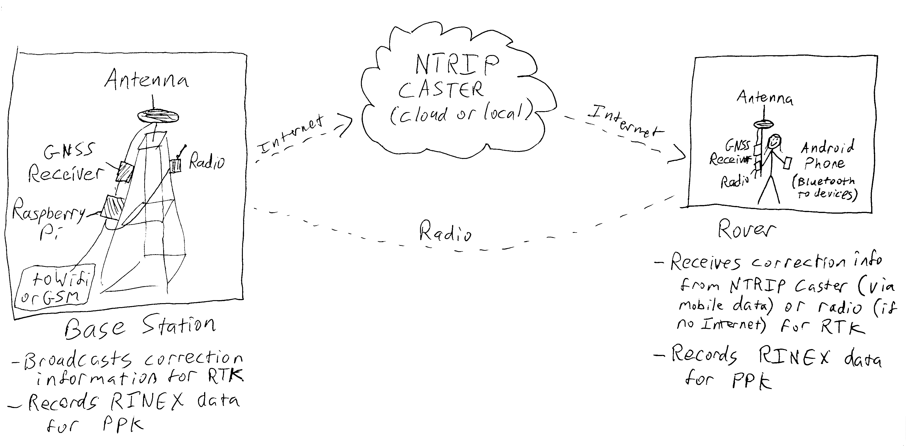

# High-Precision Positioning on Low-Cost Devices

## Goal

**A fully Free Software/Open Source toolchain allowing practical and reliable high-precision positioning on low-cost devices.**

**Specifically: enable sub-decimeter positioning with a total hardware cost under USD$300 and make it widely available in low-income areas.**

## Problem Statement

Poor people have very limited access to precise location data. Survey-grade positioning requires expensive equipment (at least $3000 for the most basic commercially available surveying GPS setup).

Small-scale, poor, and informal landholders have very limited ability to define, assert, and defend their property. Disputes and corruption are practically ubiquitous. While a technical solution alone cannot possibly hope to solve the societal issues around land ownership and title, enabling low-income people to access high-quality surveys is probably a _necessary, if not sufficient_ condition for global improvement of poor landholders' rights.

We suspect that improving land surveying for property rights is likely to be one of the most impactful outcomes of access to low-cost high-accuracy positioning. However, history has shown that when given technological tools that create fundamental new capabilities, people often make unexpected use of them. A few possibilities include:

- Allow small-scall and poor landholders to define and assert the boundaries of their plots
- Improve vehicle navigation by making it less ambiguous which road one is traveling on
- Enable large-scale precise surveying of natural features such as rivers to improve environmental monitoring
- Enable large-scale precise surveying of human infrastructure such as drainage and buildings to improve disaster preparedness

Of course, there is also potential for negative impact. It's easy to imagine lo-cost high-precision positioning being used for, say, improved targeting of improvised weapons. However, the potential benefits appear, from an initial anlysis, to be very substantial and far outweigh the potential for harm. 

## Proposed Solution

Current low-cost devices (smartphones in the range of $100 to $1,000) have satellite positioning capability with a rough error margin of five meters (certain devices can do a bit better under ideal conditions; the best-case scenario is about two meters error).

Survey-grade or geodetic satellite positioning receivers in the range of $3,000 to $50,000 can achieve positional accuracy in the range of 3-50mm. This is done by:
- Using antennas capable of receiving several frequencies of signal from positioning satellites.
- Using such antennas to estimate [carrier wave phase](https://en.wikipedia.org/wiki/Real-time_kinematic) (determining not only the position of the satellite signal but the position within the wavelength (phase) of the carrier signal)
- Using differential correction whereby measured positional errors from a satellite receive at a fixed "base station" are used to correct the positional measurements of a "rover"
- Using algorithms that account for specific types of positional error or bias in multiple positional fixes to produce statistically robust "converged" positions

All of these methods are now possible to one extent or another on low-cost devices. Inexpensive external receivers (in the $250 range) can be attached to a low-end smartphone enabling accuracy in the range of a few centimeters, and even the internal GPS on many smartphones can be used with correction techniques to produce positional accuracy in the decimeter range.

Low-cost hardware is already available for high-accuracy positioning. What's missing is software infrastructure.

There is no simple, easily implemented, widely available, Free and Open Source toolset available for making use of capability of currently available hardware to enable high-precision positioning.

We propose to provide such a toolset by collating existing utilities, building missing parts, and creating and documenting an overall workflow. We intend to work primarily with existing libraries such as [RTKLIB](http://www.rtklib.com/) and user-facing tools such as [OpenDataKit](https://opendatakit.org).

## Some Technical Details
### Toolset Architecture

Components needed:

- An Android library (or set of libraries) to manage incoming raw GNSS data and forward it to relevant clients
  - Able to communicate with both the internal GNSS receiver and with external devices via Bluetooth, USB, and WiFI
  - Able to configure and control various GNSS receivers, beginning with the [ublox ZED-F9P receiver](https://www.u-blox.com/en/product/zed-f9p-module) (essentially replacing the function of proprietary desktop-based apps like [U-Center](https://www.u-blox.com/en/product/u-center) with something useable from a mobile device with sensible defaults for common positioning tasks)
  - Able to receive and route [NMEA messages](https://en.wikipedia.org/wiki/NMEA_0183)
  - Able to receive and forward [RTCM messages and record RINEX data](http://www.rtcm.org/differential-global-navigation-satellite--dgnss--standards.html)
    - An early implementation target is set of [OpenDataKit](https://opendatakit.org) datatype that consists of raw GNSS data, allowing ODK users without Internet connectivity to record points, lines, and polygons that can be post-processed for high accuracy
  - Able to perform real-time or post-processing correction on the phone (almost certainly using [RTKLIB](http://www.rtklib.com/) as the correction engine)
  - An Android library providing access to external positioning data without necessitating enabling Developer Mode on the device (currently required to allow apps to access what is called "Mock Location" (which, confusingly, refers in this case to the true high-precision location) rather than the onboard Google Location service)
- An [NTRIP caster](https://www.use-snip.com/kb/knowledge-base/question-what-is-an-ntrip-caster/) to receive, organize, and broadcast base station correction information
  - Provided as an installable Web service that can be deployed on any local or cloud infrastructure by users who can choose to keep it private or publicly available
  - Built in such a way that makes it easy, if users choose, to freely share correction information with everyone operating in their area, making it possible for all users to have access to greater positional accuracy (essentially a peer-to-peer correction network)

### Typical deployment

The simplest survey configuration is a single base station providing correction information for a single surveyor (rover).

The base station is in a known location, either because it's placed on a known monument, or because it's been left for at least a long period ([up to 25 hours](https://www.sciencedirect.com/science/article/pii/S1110016817301795)) to collect a ["converged" position](https://d32ogoqmya1dw8.cloudfront.net/files/getsi/teaching_materials/high-precision/static_gnss_survey_methods.v4.pdf).

Correction information from the base station is either streamed to an internet site (an [NTRIP caster](https://www.use-snip.com/kb/knowledge-base/question-what-is-an-ntrip/) or broadcast by a radio connection (or both).

The surveyor or "Rover" carries a GNSS receiver and makes use of the correction information from the base station. At a minimum, this can be _nothing more than an Android phone_ provided it is capable of using raw GNSS data from the onboard receiver (most phones manufactured after 2016 with Android 7.0 or later). A more sophisticated and accurate rover setup would include an external GPS receiver and antenna. The Android application we propose to build will connect to the Internet to get correction information from the NTRIP caster and either provide it to the GNSS receiver (which may be able to calculate the differential corrections itself) or do the relevant calculations on the phone. The same Bluetooth link allows the phone to receive the positions (pre or post correction) from the GNSS receiver. In the event that there is no internet or radio connection to the base station, the application simply logs the raw GNSS data in a [RINEX](https://en.wikipedia.org/wiki/RINEX) format that allows the user to apply differential correction for high accuracy after completing the survey and retrieving the logged correction information from the base station as well.

### GNSS Receivers

The [ublox ZED-F9P receiver](https://www.u-blox.com/en/product/zed-f9p-module), a $140 chip released in 2019, toether with a [$50 to $100 antenna](https://www.ardusimple.com/store/) can be [connected to a low-end Android phone](https://github.com/hcwinsemius/RTK_GNSS) and achieve sub-decimeter precision using correction data (real-tie or post-processed) from a base station (which can also be a ublox ZED-F9P, antenna, and Raspberry Pi for a total cost under $300).

Additionally, as of 2016 Android allows direct access to the GNSS (Global Navigation Satellite System) data via [a class representing both raw and computed satellite information](https://developer.android.com/reference/android/location/GnssMeasurement.html). This is supported on [most phones manufactured in 2016 or later and shipped with Android 7.0 or higher](https://developer.android.com/guide/topics/sensors/gnss.html). The list of supported phones is growing quickly, and several are widely available in low-income countries. This means that a simple smartphone in the $100 range, without any external attachment whatsoever, can be used as a rover and achieve accuracy in the decimeter range.

### Library and application development

The GPS-enabled applications on mobile phones simply calculate their position based on the signals they receive from the satellites. They don't even record the metadata necessary to perform corrections. RTKLib can be used on Android, but it needs to be properly integrated into apps, ideally as a transparent replacement for the standard Android location API, with added functionality to allow arbitrary apps to record raw GNSS data or some subset thereof.

## Resources needed:

| Item | Units | Cost per unit | Cost |
|---|---|---:|---:|
| Android software engineering | 6 months | $12,000 | $72,000 |
| Back-end engineering | 3 months |  $12,000 | $36,000 |
| Geodesic library engineering (hard math) | 3 months | $12,000 | $36,000 |
| Project management (also codes) | 6 months | $12,000 | $72,000 |
| Admin support | 6 months, 50% time | $3,000 | $18,000 |
| Hardware | 1 pile of stuff | $5,000 | $5,000|
| **TOTAL** | | | **$239,000** | 

